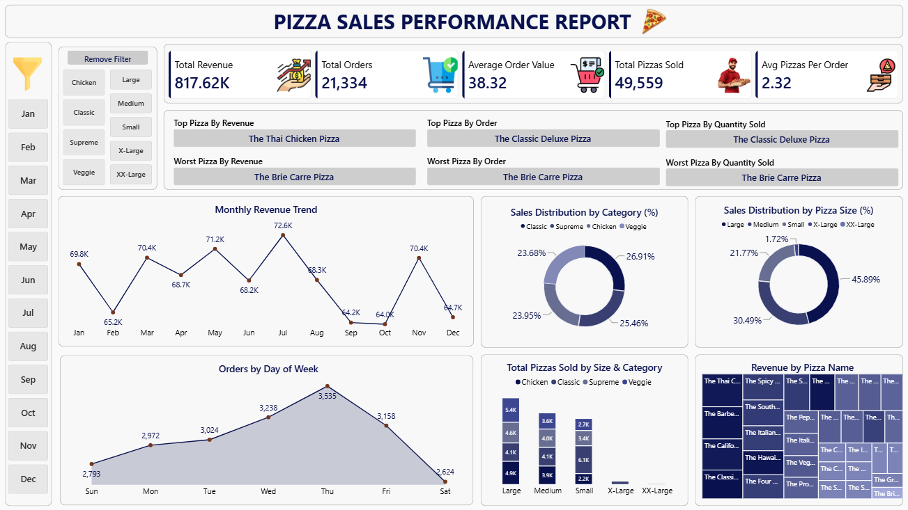

# 🍕 Pizza Sales Analytics & Business Intelligence

An end-to-end Data Analytics project that analyzes pizza sales using **PostgreSQL** and **Power BI** to uncover business insights, evaluate product performance, and build an interactive dashboard for decision-making.

---

# 📌 Project Overview

This project demonstrates a complete Business Intelligence workflow from raw transactional data to interactive dashboard development.

Using SQL for data analysis and Power BI for visualization, the project identifies key business metrics, customer purchasing behavior, sales trends, and product performance.

The objective is to support data-driven decision-making through meaningful insights and interactive reporting.

---

# 🎯 Business Problem

A pizza restaurant chain wants to better understand its sales performance and customer purchasing behavior.

Management requires a centralized reporting solution to:

- Monitor sales performance
- Track KPIs
- Identify top and low-performing pizzas
- Analyze monthly sales trends
- Understand customer purchasing patterns
- Support strategic business decisions

---

# 🛠 Tech Stack

- PostgreSQL
- SQL
- Power BI
- Git
- GitHub

---

# 📊 Dashboard Preview



---

# 📈 Key Performance Indicators

| KPI | Value |
|------|-------:|
| Total Revenue | $817,621.80 |
| Total Orders | 21,334 |
| Average Order Value | $38.32 |
| Total Pizzas Sold | 49,559 |
| Average Pizzas per Order | 2.32 |

---

# 📂 Project Structure

```text
Pizza-Sales-Analytics/
│
├── Dashboard/
├── Data/
├── SQL/
├── Reports/
├── Images/
├── README.md
└── LICENSE
```

---

# 📋 SQL Analysis

The SQL analysis includes:

- Data Validation
- KPI Calculation
- Sales Trend Analysis
- Product Performance Analysis
- Business Insights using Advanced SQL

---

# 📊 Dashboard Features

- KPI Cards
- Monthly Revenue Trend
- Orders by Day of Week
- Sales by Pizza Category
- Sales by Pizza Size
- Top & Bottom Performing Pizzas
- Interactive Filters

---

# 💡 Key Business Insights

- Generated over **$817K** in total revenue.
- Processed more than **21K customer orders**.
- Large-sized pizzas contributed the highest sales.
- Sales varied across different months, indicating seasonal demand.
- A small number of pizzas generated a significant portion of total revenue.
- Peak business hours can help optimize staffing and inventory.

---

# 📈 Business Recommendations

- Promote top-selling pizzas through combo offers.
- Increase staffing during peak hours.
- Optimize inventory based on demand.
- Improve marketing strategies for low-performing pizzas.
- Monitor KPIs regularly using Power BI.

---

# 📄 Project Report

A detailed Business Intelligence report is included in the **Reports** folder.

---

# 🚀 Future Enhancements

- Sales Forecasting using Machine Learning
- Customer Segmentation
- Inventory Optimization
- Real-Time Dashboard
- Predictive Analytics

---

# 👨‍💻 Author

**Prateek Pratap Singh**

M.Tech Student | Data Analytics Enthusiast

SQL • PostgreSQL • Power BI • Python • Machine Learning

---

## ⭐ If you found this project useful, consider giving it a star.
